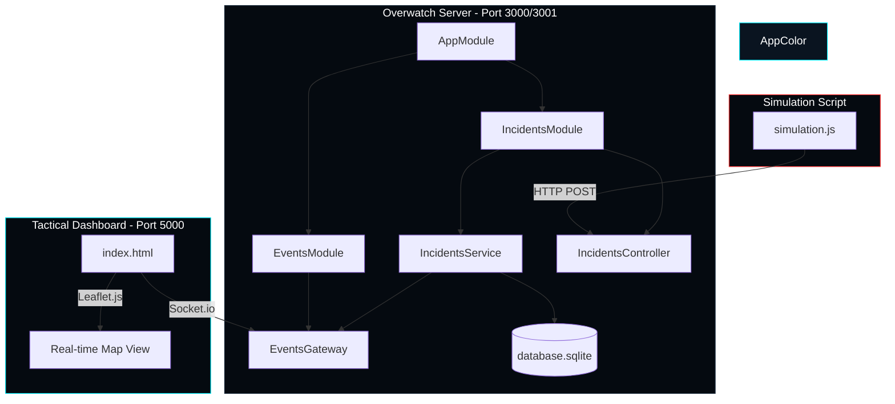

# Overwatch System Architecture

เอกสารวิเคราะห์โครงสร้างสถาปัตยกรรมของโครงการ Overwatch (Sovereign AI Defense System).

## 1. การไหลของข้อมูล (Tactical Data Flow)

ระบบ Overwatch ถูกออกแบบมาให้มีการสื่อสารแบบ Event-driven และทำงานแยกส่วนกันเพื่อประสิทธิภาพสูงสุด ข้อมูลจะไหลผ่าน 6 ชั้นยุทธศาสตร์ดังนี้:

1.  **Simulation Layer (`simulation.js`)**: ชุดข้อมูลจริง (RAG) จะถูกสุ่มขึ้นมาและส่งไปยัง NestJS API ผ่าน HTTP POST Request ทุก 5 วินาที
2.  **Controller Layer (`incidents.controller.ts`)**: รับข้อมูล (DTO) และส่งต่อไปยังชั้น Service
3.  **Service Layer (`incidents.service.ts`)**: 
    - ส่งข้อความเข้าสู่ **Intelligence Engine** (`analyzeThreat`) เพื่อคัดกรอง Keyword และจัดระดับความสำคัญ (HIGH/LOW)
    - ทำการระบุพิกัดภูมิศาสตร์ (Reality Anchoring)
4.  **Persistence Layer (TypeORM/SQLite)**: บันทึกข้อมูลที่วิเคราะห์เสร็จสมบูรณ์ลงในฐานข้อมูล `database.sqlite`
5.  **Broadcast Layer (`events.gateway.ts`)**: ข้อมูลที่ถูกบันทึกจะถูกส่งต่อไปยัง **EventsGateway** เพื่อกระจายสัญญาณ (Emit) ผ่าน WebSocket (Port 3001) ไปยัง Client ทุกตัว
6.  **Visualization Layer (`index.html`)**: 
    - WebSocket Client รับข้อมูลเหตุการณ์ใหม่
    - ปักหมุดบนแผนที่ **Leaflet.js** พร้อมแสดงผลตามระดับความสำคัญ
    - อัปเดตข้อมูลบน **Tactical Sidebar** ทันที

---

## 2. โครงสร้างโมดูล (NestJS Module Map)

---

## 3. สรุปความสัมพันธ์ (Logical Dependency)
- **REST API (Port 3000)**: ใช้สำหรับการรับ-ส่งข้อมูลแบบดั้งเดิม (Ingestion)
- **WebSockets (Port 3001)**: ใช้สำหรับการกระจายข้อมูลแบบ Real-time (Distribution)
- **Intelligence Logic**: ฝังอยู่ใน `IncidentsService` ทำหน้าที่เป็นผู้ช่วยตัดสินใจเบื้องต้นให้กับระบบ
